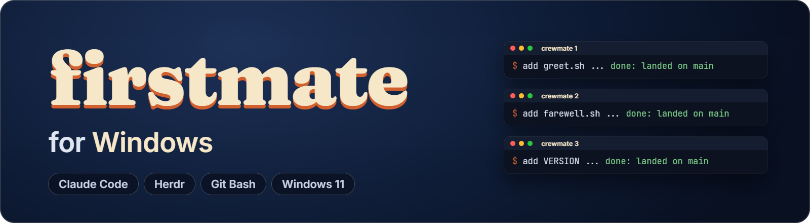
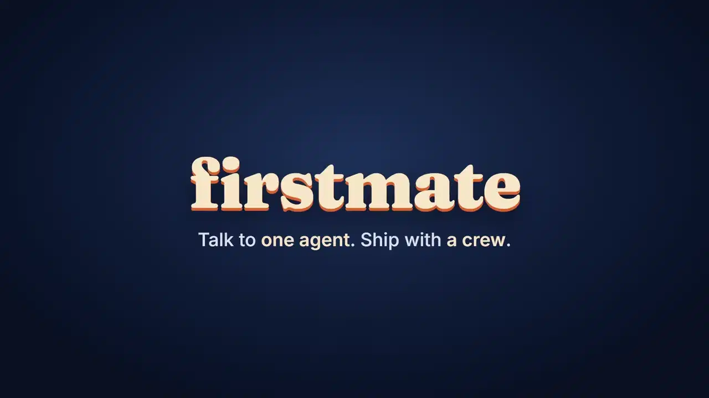
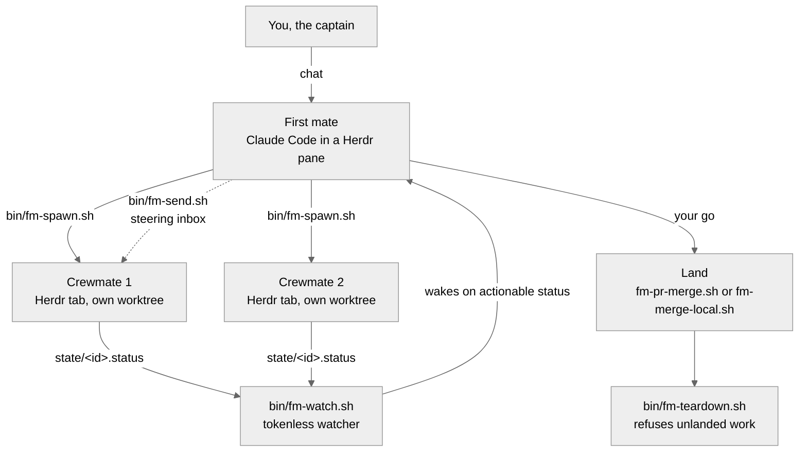
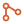
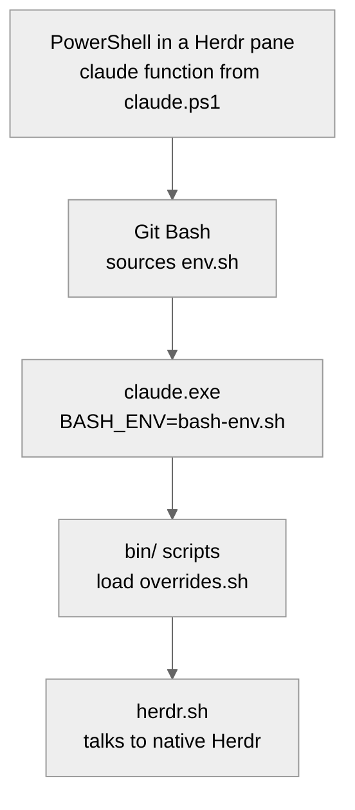

<div align="center">

<p>
  
</p>

<p>
  <a href="https://github.com/EvanBatten/firstmate-for-windows/actions/workflows/ci.yml"></a>
  
  <a href="https://docs.anthropic.com/en/docs/claude-code"></a>
  <a href="docs/herdr-backend.md"></a>
  <a href="LICENSE"></a>
  <a href="https://github.com/EvanBatten/firstmate-for-windows/commits/main"></a>
</p>

<p>
  <a href="#install">Install</a> ·
  <a href="#talk-to-it">Talk to it</a> ·
  <a href="#features">Features</a> ·
  <a href="#how-it-works">How it works</a> ·
  <a href="#built-for-windows">Built for Windows</a> ·
  <a href="#proven-in-real-sessions">Proof</a> ·
  <a href="#get-help">Help</a>
</p>

</div>

<p align="center">
  
  <br />
  <sub>A real firstmate session with three crewmates, sped up.</sub>
</p>

## What it is

firstmate runs a crew of coding agents for you on Windows 11.
You talk to one Claude Code session, the first mate.
It starts each task as a crewmate in its own Herdr tab and its own git worktree, watches the crew without spending tokens, and brings you back finished pull requests, approved local merges, and investigation reports.

There is no app to install.
The cloned repo is the product: [`AGENTS.md`](AGENTS.md) is the first mate's contract, `.agents/skills/` holds the procedures it loads, and `bin/` holds the scripts it runs.
`platform/windows/` adapts those scripts to Git Bash, Windows paths, and a native Herdr.

## Install

You need Windows 11 with Developer Mode on, and these tools on `PATH`: Git for Windows (for Git Bash), PowerShell 7, the GitHub CLI, Node.js, jq, Claude Code, Herdr, and Treehouse 2.0.1.
[Install on Windows](platform/windows/INSTALL.md) has the `winget` and download command for each one.

Then clone with symlinks on:

```sh
gh auth login
git clone -c core.symlinks=true https://github.com/EvanBatten/firstmate-for-windows firstmate
cd firstmate
```

Then follow the [launch steps](platform/windows/INSTALL.md#launch) once to load the overlay's `claude` function in Herdr's PowerShell.
After that, every launch is `herdr`, then `claude` from the clone.
On its first start, the first mate lists any tool it is still missing and asks before it installs one.

## Talk to it

```text
> ahoy! look at my github project xyz, then fix the flaky login test and add dark mode

# The first mate checks its tools, clones xyz under projects/,
# and starts two crewmates, each in its own Herdr tab and worktree.
# Minutes later:

  PR ready for review, captain: https://github.com/you/xyz/pull/42
  (fix flaky login test - risk: low - CI green)

> alright merge it
```

You never type into a crewmate's tab unless you want to.
The first mate brings you only what needs your word: a review, a merge, a design choice, or a blocker.

## Features

 marks a feature that a recorded real session proved on Windows.
 marks a feature the code has that no Windows session has proved yet, with the issue that tracks it.

-  **One liaison.** You talk only to the first mate, which dispatches, supervises, and brings you only the decisions that are yours.
  Proven by the [`whole-session`](tools/fm-drive/traces/whole-session.json) drive.
-  **A visible crew.** Each crewmate works in its own Herdr tab, running Git Bash, that you can watch or type into.
  Proven by the [`ship-local`](tools/fm-drive/traces/ship-local.json) drive.
-  **Disposable worktrees.** Each task runs in a clean [Treehouse](platform/windows/INSTALL.md#install-the-tools) git worktree, so parallel work on one repo never collides.
  Proven by the [`whole-session`](tools/fm-drive/traces/whole-session.json) drive, three crewmates on one repo.
-  **Ship and scout tasks.** A ship task delivers a change, and a scout task leaves a written report at `data/<id>/report.md` before its worktree goes.
  Proven by the [`scout-report`](tools/fm-drive/traces/scout-report.json) drive.
-  **Project modes.** Each project ships through `no-mistakes`, `direct-PR`, or `local-only`, and `+yolo` lets the first mate merge green work itself.
  The `pr-land` and `ship-local` drives prove `direct-PR` and `local-only` landing, and [#84](https://github.com/EvanBatten/firstmate-for-windows/issues/84) tracks the rest.
-  **Second mates.** Persistent second mates run from their own isolated firstmate homes.
  No Windows session has proved it yet, see [#89](https://github.com/EvanBatten/firstmate-for-windows/issues/89).
-  **Tokenless supervision.** A bash watcher sleeps on the crew and wakes the first mate only when something needs it, and Claude Code's Stop hook re-arms it at every turn end.
  Proven by the [`watcher-wake`](tools/fm-drive/traces/watcher-wake.json) drive.
-  **Relay.** Relay is an opt-in bridge that lets the first mate answer public mentions on X and Discord.
  The maintainer's Windows machine cannot verify it yet, see [#97](https://github.com/EvanBatten/firstmate-for-windows/issues/97).
-  **A strict project boundary.** The first mate reads your projects but never changes them outside its guarded paths, and crewmates make every change.
  [#83](https://github.com/EvanBatten/firstmate-for-windows/issues/83) tracks the session-level proof.
-  **Restart-proof.** All state lives on disk and in Herdr, so a new session takes the lock, finds the crew from its records, and carries on.
  Proven by the [`restart-primary`](tools/fm-drive/traces/restart-primary.json) drive.

## How it works

You chat with the first mate in a Herdr pane.
Every action it takes goes through a script in `bin/`, and every crewmate reports back through a status file the watcher reads.



A task moves through the same steps every time:

1. `bin/fm-session-start.sh` takes the home's session lock and prints one digest of projects, backlog, and live crew.
2. `bin/fm-spawn.sh` creates a Treehouse worktree, opens a Herdr tab running Git Bash in it, and starts the crewmate on a written brief.
3. `bin/fm-send.sh` writes any steering message to the task's durable inbox and rings the crewmate's tab.
4. `bin/fm-watch.sh` blocks until a crewmate's status needs attention, then wakes the first mate with one reason line.
5. `bin/fm-pr-merge.sh` merges an approved PR and confirms GitHub reports it landed, and `bin/fm-merge-local.sh` fast-forwards main for a `local-only` task.
6. `bin/fm-teardown.sh` returns the worktree and closes the tab, and it refuses while the task has uncommitted or unlanded work.

[docs/architecture.md](docs/architecture.md) covers the supervision engine, worktree isolation, project modes, and self-update in full.

## Built for Windows

The shared scripts in `bin/` are written for a Unix shell.
Seven files in `bin/` load `platform/windows/overrides.sh` through one line each, and `platform/windows/env.sh` sets up every Git Bash the overlay reaches.

<table>
  <tr>
    <td width="33%" valign="top">
      <br />
      <b>Launch through Git Bash</b><br />
      <code>claude.ps1</code> wraps <code>claude</code> in your PowerShell profile, so the session starts from a Git Bash with <code>env.sh</code> sourced and can own the session lock.
    </td>
    <td width="33%" valign="top">
      <br />
      <b>Git Bash in every Herdr pane</b><br />
      <code>herdr.sh</code> lays out each new tab with Git Bash on <code>pane-rc.sh</code> instead of typing into PowerShell, and turns off MSYS path rewriting for every Herdr call.
    </td>
    <td width="33%" valign="top">
      <br />
      <b>One spelling per path</b><br />
      <code>path.sh</code> makes <code>pwd</code> answer in the same spelling <code>cygpath -u</code> gives, so <code>/tmp/x</code> and its <code>%TEMP%</code> twin compare equal.
    </td>
  </tr>
  <tr>
    <td width="33%" valign="top">
      <br />
      <b>Real symlinks</b><br />
      <code>env.sh</code> sets <code>MSYS=winsymlinks:nativestrict</code>, and <code>symlinks.sh</code> repairs a clone made without <code>core.symlinks=true</code> on every launch.
    </td>
    <td width="33%" valign="top">
      <br />
      <b>Both process trees</b><br />
      <code>proc.sh</code> walks the MSYS and Win32 process trees together, because a bash that a native program starts reports parent pid 1.
    </td>
    <td width="33%" valign="top">
      <br />
      <b>Private by folder ACL</b><br />
      Git Bash ignores <code>chmod</code>, so <code>env.sh</code> checks that the home's ACL names only you, SYSTEM, and Administrators, and <code>private-root.sh apply</code> fixes one that does not.
    </td>
  </tr>
</table>

Starting `claude` from the clone runs this chain:



## Proven in real sessions

Each trace below is a script of captain messages in plain English.
`node tools/fm-drive/drive.mjs run <trace.json>` plays it against a real first mate in a throwaway home on Windows, and the run passes only when the home's own records show each claim within its time budget.
All nine passed at commit `90fa7f8f`, recorded in [`behaviors.tsv`](.agents/skills/verify-firstmate/behaviors.tsv).

| Trace | What the captain asks for, and what must become true |
|---|---|
| [`register`](tools/fm-drive/traces/register.json) | Add a project, and the session start runs once |
| [`ship-local`](tools/fm-drive/traces/ship-local.json) | One change in a visible tab, checked, landed on main, cleaned up |
| [`steer`](tools/fm-drive/traces/steer.json) | A new requirement mid-task reaches the crewmate and lands in its change |
| [`watcher-wake`](tools/fm-drive/traces/watcher-wake.json) | The first mate ends its turn, and the crewmate's finish wakes it |
| [`pr-land`](tools/fm-drive/traces/pr-land.json) | A pull request opened, merged on your word, and confirmed landed |
| [`cleanup-refusal`](tools/fm-drive/traces/cleanup-refusal.json) | Cleanup of unlanded work is refused, then the work lands |
| [`restart-primary`](tools/fm-drive/traces/restart-primary.json) | The session exits mid-task, and a new one picks up the crew |
| [`scout-report`](tools/fm-drive/traces/scout-report.json) | An investigation leaves a report, then the same crewmate builds from it |
| [`whole-session`](tools/fm-drive/traces/whole-session.json) | Three changes in parallel, three landings on main, a healthy home |

The [`verify-firstmate`](.agents/skills/verify-firstmate/SKILL.md) skill keeps the full inventory of claims and marks each one proven, unproven, or blocked on this machine.

<details>
<summary><b>Built-in skills</b></summary>

Type these in the first mate's chat.
They ship with the code, and their Windows proof is still open in the issue named beside each.

| Skill | What it does |
|---|---|
| `/afk` | Hands supervision to a background daemon while you step away, and briefs you when you return ([#94](https://github.com/EvanBatten/firstmate-for-windows/issues/94)) |
| `/quiet` | Keeps routine wakes out of the chat while you stay, until `/quiet off` ([#94](https://github.com/EvanBatten/firstmate-for-windows/issues/94)) |
| `/ahoy` | Recaps what happened since your last message and walks you through open decisions one at a time ([#95](https://github.com/EvanBatten/firstmate-for-windows/issues/95)) |
| `/bearings` | Prints a four-section digest of the fleet, and `/bearings file` also writes it to `data/` ([#95](https://github.com/EvanBatten/firstmate-for-windows/issues/95)) |
| `/updatefirstmate` | Fast-forwards this clone from `origin` and restarts every live mate on the new commit ([#93](https://github.com/EvanBatten/firstmate-for-windows/issues/93)) |
| `/stow` | Saves what the session learned to disk and trims startup memory before a reset ([#95](https://github.com/EvanBatten/firstmate-for-windows/issues/95)) |

`.agents/skills/` also holds the agent-only skills the first mate loads at the triggers [`AGENTS.md`](AGENTS.md) names.
`skills/` holds `stow`, a public skill you can install into any project on its own.

</details>

<details>
<summary><b>Other platforms and harnesses</b></summary>

The same checkout runs on Linux and macOS, where tmux is the default backend, as [docs/tmux-backend.md](docs/tmux-backend.md) describes.
CI runs the behavior suites on Linux, the Herdr suite on Linux, and a Bash compatibility check on macOS.
The code also supports Codex, Grok, Pi, OpenCode, Cursor Agent CLI, and Oh My Pi as the primary harness, and Zellij, Orca, and cmux as backends.
No Windows session has verified those yet, see [#97](https://github.com/EvanBatten/firstmate-for-windows/issues/97).
[docs/configuration.md](docs/configuration.md#harness-support) lists what each one needs.

</details>

<details>
<summary><b>Documentation</b></summary>

- [Install on Windows](platform/windows/INSTALL.md) - tools, clone, launch, and symlink repair.
- [docs/architecture.md](docs/architecture.md) - the crew, supervision, worktrees, second mates, and project modes.
- [docs/configuration.md](docs/configuration.md) - environment variables, `FM_HOME`, backend selection, Relay setup, and the files you set.
- [docs/herdr-backend.md](docs/herdr-backend.md) - setup, CI coverage, safety boundaries, and limits of the Herdr backend.
- [docs/tmux-backend.md](docs/tmux-backend.md), [docs/zellij-backend.md](docs/zellij-backend.md), [docs/orca-backend.md](docs/orca-backend.md), and [docs/cmux-backend.md](docs/cmux-backend.md) - the other backends.
- [docs/remote-secondmates.md](docs/remote-secondmates.md) - second mates on another SSH-reachable host.
- [docs/wedge-alarm.md](docs/wedge-alarm.md) - an alert for an away-mode escalation that gets stuck.
- [docs/turnend-guard.md](docs/turnend-guard.md) - the backstop that keeps a turn from ending while work is unsupervised.
- [docs/calm.md](docs/calm.md) - the `/calm` presentation toggle.
- [docs/scripts.md](docs/scripts.md) - the `bin/` reference.
- [docs/documentation-audiences.md](docs/documentation-audiences.md) - who each doc is for, checked by `bin/fm-doc-audience-check.sh`.
- [`AGENTS.md`](AGENTS.md) - the first mate's contract.

</details>

## Get help

Open an issue at [EvanBatten/firstmate-for-windows](https://github.com/EvanBatten/firstmate-for-windows/issues).
Include the first mate's session-start digest and the output of `herdr --version` and `bash --version`.

## Contributing

[CONTRIBUTING.md](CONTRIBUTING.md) has the workflow, the repo conventions, and the test commands.

## Credits

firstmate for Windows is a Windows port of [firstmate](https://github.com/kunchenguid/firstmate) by Kun Chen.
The design, the first mate's contract, and the shared scripts in `bin/` come from his project.

## License

MIT, see [LICENSE](LICENSE).
